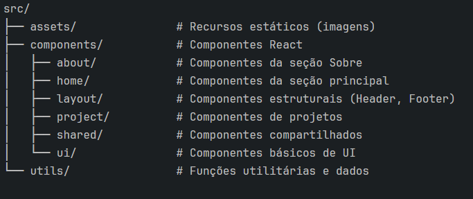

# Leonardo Mendes – Portfólio de Desenvolvedor Frontend

---

## 📋 Visão Geral

Este projeto é um portfólio profissional desenvolvido para destacar minha experiência, habilidades e projetos como Desenvolvedor Frontend. Construído com foco em **acessibilidade**, **performance** e **design responsivo**, o site oferece uma interface moderna e interativa.

---

## ✨ Características Principais

- 🎨 **Design Minimalista**: Interface limpa e moderna, com foco no conteúdo  
- ♿ **Acessibilidade**: Implementado com as melhores práticas WCAG  
- 📱 **Responsividade**: Layout adaptável a todos os dispositivos  
- 💫 **Animações Suaves**: Transições fluidas e feedback visual  
- 🌗 **Modo Escuro/Claro**: Alternância de tema para conforto visual  
- 📄 **Download de Currículo**: Link direto para currículo em PDF  

---

## 🧠 Tecnologias Utilizadas

- **React** – Interfaces declarativas e reativas  
- **TypeScript** – Tipagem estática para maior segurança  
- **Tailwind CSS 4.1** – Estilização utilitária e produtiva  
- **Vite** – Build tool extremamente rápido  
- **Framer Motion** – Animações fluidas e interativas  
- **Lucide Icons** – Ícones SVG modernos  
- **Radix UI** – Componentes acessíveis e customizáveis  

---

## 🌟 Seções do Portfólio

### 📱 Home  
Apresenta minha identidade profissional, stack de tecnologias e links para redes sociais.

### 💼 Projetos  
Exibe os projetos desenvolvidos com descrições, stacks utilizadas e links úteis.

### 👨‍💻 Sobre Mim  
Traz detalhes da minha trajetória, formação e objetivos profissionais.

---

## 🚀 Arquitetura do Projeto

## 🎯 Acessibilidade e SEO

O portfólio foi desenvolvido com foco em acessibilidade e otimização para mecanismos de busca:

- 🔤 **Hierarquia semântica de títulos**: Estrutura de headings adequada (`h1`, `h2`, etc.)
- ♿ **Atributos ARIA**: Melhoram a experiência para leitores de tela
- 🎨 **Contraste e legibilidade**: Cores com contraste adequado
- 🔍 **Meta tags otimizadas**: Melhor indexação nos mecanismos de busca
- 🖼️ **Imagens otimizadas**: `alt` descritivo e carregamento eficiente

---

## 📊 Performance

O site foi otimizado para carregar rapidamente, com:

- 💤 **Carregamento Lazy**: Para imagens e componentes secundários
- 📦 **Bundle minificado**: Tamanho dos arquivos reduzido com Vite
- 🎞️ **Animações eficientes**: Suaves sem comprometer a performance
- 🖱️ **Scrollbar personalizada**: UX de navegação mais fluida

---

## 📱 Responsividade

Totalmente responsivo, se adapta a todos os dispositivos:

- 📱 **Smartphones**: ≥ 320px  
- 📲 **Tablets**: ≥ 768px  
- 💻 **Desktops**: ≥ 1024px  
- 🖥️ **Monitores grandes**: ≥ 1440px

## 🧪 Executando o Projeto

------------------------------------------------------------------------------
# Clone o repositório
git clone https://github.com/leonardomendescastilho/portfolio.git

# Entre no diretório
cd portfolio

# Instale as dependências
npm install

# Execute em desenvolvimento
npm run dev

# Build para produção
npm run build
------------------------------------------------------------------------------